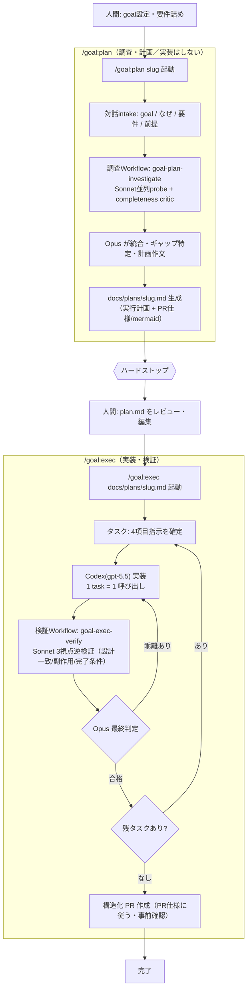

# Claude Code 開発フロー設定

このリポジトリは、全プロジェクト共通の Claude Code 開発フロー設定の正本です。README は案内板として、フローの全体像を視覚化し、クイックスタートと索引を提供します。

フロー定義の正本は [CLAUDE.md](CLAUDE.md) です。詳細な契約、停止条件、モデル方針、Skills config は README に重複させず、[CLAUDE.md](CLAUDE.md) を参照してください。

## AI自動開発フロー図



## 開発フロー（自然言語）

この開発フローは役割反転を前提にします。人間は goal 設定と要件詰めを担い、Claude（Opus）は設計・レビュー・検証の最終判定を担い、Codex（gpt-5.5）は実装と修正を担います。

流れは次の通りです。

1. 人間が goal と要件を渡します。
2. `/goal:plan` が調査 Workflow を使って計画 `docs/plans/<slug>.md` を生成し、そこで停止します。実装・編集・codex 呼び出しは行いません。
3. 人間が生成された plan.md をレビューし、必要に応じて編集します。
4. `/goal:exec` が承認済み plan.md を唯一の真実として、タスクごとに「4項目指示 → codex 実装 → 検証 Workflow で多視点逆検証 → Opus 最終判定」を回します。乖離があれば Codex に差し戻し、合格したタスクだけ次へ進みます。
5. 全タスク合格後、plan.md の `## PR仕様` に従って構造化 PR を作成します。

## /goal:plan の使い方（prompt雛形）

```
/goal:plan <goal-slug>

goal: <達成したいゴール>
なぜ: <なぜ必要か / 背景>
要件: <満たすべき条件・制約・成果物>
前提: <把握している前提情報・対象範囲・関連ファイル>
```

計画を生成して停止します。実装はしません。

## /goal:exec の使い方（prompt雛形）

```
/goal:exec docs/plans/<goal-slug>.md
```

承認済み plan.md のパスのみを渡します。plan.md が唯一の真実です。

## 役割分担とモデル方針

| 担当 | 役割 | モデル方針 |
| --- | --- | --- |
| 人間 | goal 設定、要件詰め、plan.md のレビュー・承認 | 最終的な目的と制約を決める |
| Opus | 設計、統合、レビュー、検証の最終判定 | 判断・合否・差し戻しを担う |
| Sonnet | 調査 fan-out、completeness critic、3視点逆検証 | 並列調査と検証観点の洗い出しを担う |
| Codex（gpt-5.5/xhigh） | 実装、修正、テスト実行 | 1 task = 1 呼び出しで plan に従って変更する |

詳細は [CLAUDE.md](CLAUDE.md) を参照してください。

## 構成

| パス | 説明 |
| --- | --- |
| [CLAUDE.md](CLAUDE.md) | 開発フロー正本 v3。役割反転、モデル方針、plan-exec 契約、停止条件、Skills config を定義します。 |
| [commands/goal/plan.md](commands/goal/plan.md) | `/goal:plan` の定義。調査から計画生成までを行い、実装前に停止します。 |
| [commands/goal/exec.md](commands/goal/exec.md) | `/goal:exec` の定義。承認済み plan.md を唯一の真実として実装・検証・PR 作成を進めます。 |
| [workflows/goal-plan-investigate.workflow.js](workflows/goal-plan-investigate.workflow.js) | `/goal:plan` 用の調査 fan-out Workflow です。 |
| [workflows/goal-exec-verify.workflow.js](workflows/goal-exec-verify.workflow.js) | `/goal:exec` 用の 3視点逆検証 Workflow です。 |
| [skills/](skills/) | phase-* / pj-* などのスキル群を配置します。 |
| [settings.json](settings.json) | Claude Code のリポジトリ設定です。 |

`~/.codex/config.toml` と `~/.codex/rules/default.rules` はマシンローカル・版管理外の設定であり、本リポジトリには含まれません。

## 各プロジェクトの接続

各プロジェクトの `CLAUDE.md` は、開発フローの必読ポインタとして「開発フローは global `~/.claude/CLAUDE.md` と `/goal:plan`・`/goal:exec` を正本とする」旨を持ちます。

また、phase-* skill が読む `## Skills config` を持ちます。主な項目は `base_branch`、`branch_pattern`、`phase_registry`、`tasks_file`、`design_dir`、`commit_msg_hook_requires_tasks` などです。

## ブランチ運用

本リポジトリでは `develop` で作業し、`develop → main` の PR で反映します。

## その他のスキル（別軸）

`phase-*`（フェーズ運用）と `pj-*`（プロジェクト開閉）skills は、goal plan/exec とは別軸のフローとして共存します。詳細は [CLAUDE.md](CLAUDE.md) の `## Skills config` を参照してください。
