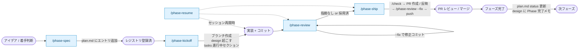
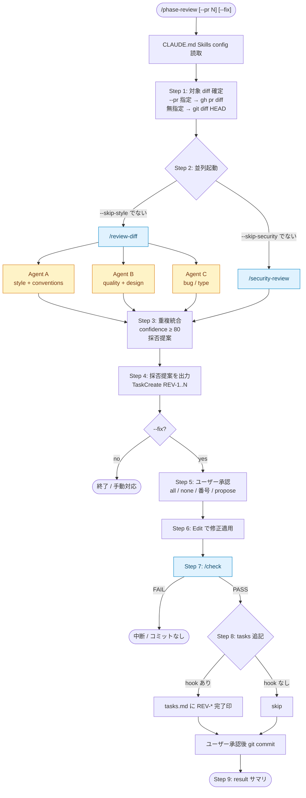
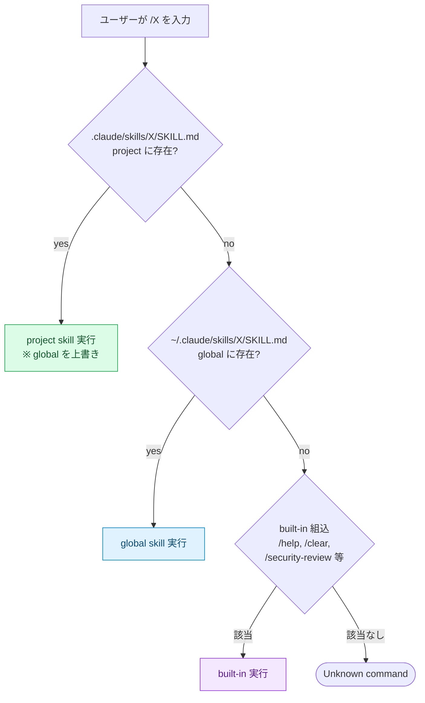
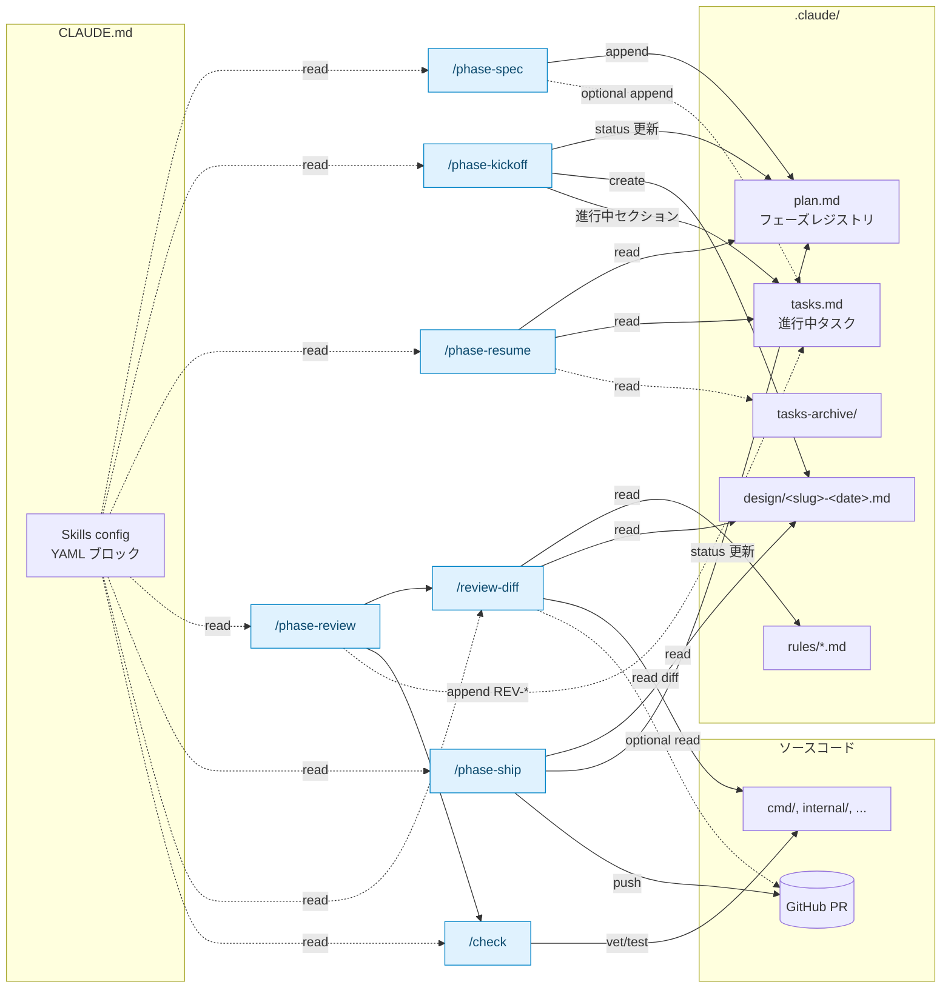

# Phase-flow 構成: nestify vs cf-local

`/phase-*` + `/review-diff` + `/check` を中心とした開発フローを 2 PJ で揃えた記録 (2026-04-30)。

3 つ目以降の PJ で同じ構成を立ち上げるためのテンプレ + 今回見えた課題のメモ。

---

## 1. 構成要素の対応表

| 役割 | nestify (Bun + TS) | cf-local (Go) |
|---|---|---|
| **CLAUDE.md `Skills config`** | あり (Bun コマンド前提) | あり (`commit_msg_hook_requires_tasks: false`) |
| **必読順序** | CLAUDE.md / 各種 docs | README → DESIGN.md → plan.md → tasks.md → design/<active> → conventions.md |
| **ベースブランチ** | `develop` | `develop` |
| **commit-msg hook** | あり (`tasks.md` 必須) | **なし** |
| **`/phase-kickoff`** | global skill (`~/.claude/skills/`) | global skill |
| **`/phase-resume`** | global skill | global skill |
| **`/phase-spec`** | global skill | global skill |
| **`/phase-ship`** | global skill | global skill |
| **`/phase-review`** | project 上書き有 (旧インライン版) | **global のみ** (新 /check 委譲版) |
| **`/review-diff`** | project skill (subagent: code-reviewer × 3) | project skill (subagent: general-purpose × 3) |
| **`/check`** | project skill: tsc / BE test / FE test / FE lint | project skill: `go vet` / `gofmt -l .` / `go test ./internal/...` |
| **`.claude/rules/`** | 5 ファイル (backend, frontend, code-style, quality, testing) | 2 ファイル (code-style, quality) |
| **`.claude/agents/`** | 3 つ (code-architect, code-explorer, code-reviewer) | **なし** |
| **`.claude/plan.md`** | フェーズレジストリ | フェーズレジストリ |
| **`.claude/tasks.md`** | 進行中タスク | 進行中タスク |
| **`.claude/design/<slug>-<date>.md`** | フェーズ詳細設計 | フェーズ詳細設計 |
| **`.claude/tasks-archive/`** | あり | (空 or 未生成) |

---

## 2. 差分とその理由

### 2.1 `/check` の中身 (Bun ↔ Go)

| | nestify | cf-local |
|---|---|---|
| 並列タスク数 | 4 | 3 |
| 型チェック | `bunx tsc --noEmit` (`-p packages/...` で分割) | `go vet ./...` (型 + 静的解析を兼ねる) |
| フォーマット | (lint に含まれる) | `gofmt -l .` (出力あれば FAIL) |
| ユニットテスト | BE / FE 2 系統 | `go test ./internal/...` (1 系統) |
| Lint | FE のみ (`bun lint`) | (vet + gofmt で代替) |
| 統合テスト | E2E は除外 | integration / α regression は除外 |

**理由**: 言語ツールチェーンの違い。Go は `go vet` が型 + 簡易静的解析を兼ね、`gofmt -l .` が空出力 = 整形済みという素朴な判定で済む。Bun/TS は tsc / lint / test が分かれているのでタスクが増える。

### 2.2 `/review-diff` の subagent

| | nestify | cf-local |
|---|---|---|
| subagent_type | `code-reviewer` (project agent) | `general-purpose` |
| ルールファイル | 5 種類を用途ごとに振り分け | 2 種類 + CLAUDE.md / DESIGN.md / docs/conventions.md を直接 Read |
| Agent A | code-style + quality | code-style + conventions |
| Agent B | (frontend or backend) + testing | quality + DESIGN.md (スコープ + テストファースト) |
| Agent C | バグ + 型 + セキュリティ | バグ + 型。**セキュリティ機能の欠如は指摘しない** (DESIGN.md 前提) |

**理由**:
- nestify はカスタム `code-reviewer` agent を作り込んでいるが、cf-local では未整備のため `general-purpose` で代替。指摘の質を上げるなら次は cf-local 側にも `.claude/agents/code-reviewer.md` を起こすのが第一歩。
- ルール数の差は「コードベースの広さ」の差。cf-local は Go 単体 + njs 少々なので 5 ファイル分は無くて良い。
- セキュリティ観点を抑える指示は cf-local 固有。**ローカル開発ツール**という DESIGN.md 前提があるため、認証 / 暗号化の不在を指摘されても無価値。

### 2.3 `/phase-review` の所在

| | nestify | cf-local |
|---|---|---|
| project skill | あり (旧インライン /check 版) | **無し** (global を使う) |
| Step 7 検証 | tsc/test/lint をインライン記述 | `/check` skill 委譲 |

**理由**: global の phase-review は最近 `/check` 委譲型にリファクタされた。nestify 版は project skill が globalより古い実装で残っている。cf-local では project skill を作らず global を使う方が綺麗。
→ **改善余地**: nestify の project 版 phase-review を global 委譲型に揃えると、project からは消せる (DRY)。

### 2.4 `commit_msg_hook_requires_tasks`

| | nestify | cf-local |
|---|---|---|
| 値 | `true` (既定) | `false` (CLAUDE.md で明示) |

**理由**: nestify は `.git/hooks/commit-msg` で `tasks.md` への進捗追記を強制。cf-local はそのフックを未導入のため、`/phase-review --fix` の Step 8 で tasks 追記をスキップしてよい。導入の有無は PJ ポリシー次第なので config で吸収する形になっている。

---

## 3. 複製テンプレ (3 つ目の PJ を立ち上げる手順)

新 PJ で同じフローを動かすためのチェックリスト。

### 3.1 必須 (これだけで `/phase-*` + `/phase-review` が動く)

- [ ] `CLAUDE.md` を作成し、必読順序 + 作業哲学 + `## Skills config` ブロックを入れる
  - `phase.base_branch` (PJ の develop 相当)
  - `phase.commit_msg_hook_requires_tasks` (hook を入れるかどうか)
  - 他は既定で十分
- [ ] `.claude/plan.md` を作成 (空のフェーズレジストリ)
- [ ] `.claude/tasks.md` を作成 (空 or 進行中フェーズの雛形)
- [ ] `.claude/design/` ディレクトリを作成
- [ ] `.claude/skills/check/SKILL.md` を作成 — **PJ 固有のコマンドを並列化**
- [ ] `.claude/skills/review-diff/SKILL.md` を作成 — Step 2 の Read 対象と Step 3 の subagent 担当ルールを PJ に合わせて差し替え
- [ ] `.claude/rules/code-style.md` と `.claude/rules/quality.md` を最小セットで起こす

### 3.2 任意 (規模が大きくなったら)

- [ ] `.claude/agents/code-reviewer.md` を作成 → `/review-diff` の subagent_type を切り替え
- [ ] `.claude/rules/` を領域別に分割 (例: `backend.md` / `frontend.md` / `testing.md`)
- [ ] commit-msg フックを導入し、`commit_msg_hook_requires_tasks: true` に切り替え
- [ ] `.claude/tasks-archive/` を導入してフェーズ完了タスクを保管

### 3.3 不要 (project 上書きしない)

- `~/.claude/skills/` 配下の `phase-kickoff` / `phase-resume` / `phase-spec` / `phase-ship` / `phase-review` は global のまま使う。
  PJ 固有事項は `Skills config` ブロックで吸収できる設計になっている。

---

## 4. 今回見えた課題 / 改善ポイント

### 4.1 nestify の `/phase-review` が古い

global は `/check` 委譲型に進化したが nestify project 版は旧インライン版のまま。
→ nestify の `.claude/skills/phase-review/SKILL.md` を消すか、global と同じく `/check` 委譲版に書き換える。**機能差は出ないので消す方が DRY**。

### 4.2 cf-local の subagent 品質

`general-purpose` 代替なので、`code-reviewer` 専用 agent を作ったときに比べてレビュー粒度が粗くなりがち。
→ cf-local の規模が拡大して気になり始めたら `.claude/agents/code-reviewer.md` を起こす。優先度は中。

### 4.3 `Skills config` の発見性

CLAUDE.md の中盤に置いてあるだけで、新 PJ 立ち上げ時に「これがある前提」と気付けない。
→ `~/.claude/skills/phase-kickoff/SKILL.md` のキックオフ手順に「CLAUDE.md に Skills config がなければ追加する」を追記する余地あり。
→ もしくは本ドキュメント (このファイル) を `phase-kickoff` 冒頭から参照させる。

### 4.4 `.claude/rules/` の運用負荷

ルール変更 → review-diff の Read 対象更新が必要。コードベースが小さいうちは「rules 不要、CLAUDE.md / conventions.md を直接 Read」で済ませる選択肢も成立する。
→ cf-local は今 2 ファイルだが、もし 1 ファイルにまとまってしまうなら conventions.md だけ Read して rules を消す決断もありうる。

### 4.5 `/check` の性能

cf-local は 3 並列で軽量 (~5s)。nestify は 4 並列で 30s 前後。
→ 大きな差ではないが、tsc が遅い PJ では `--noEmit` を分割して `incremental` を効かせる工夫が要る。

### 4.6 PJ 間の sync 戦略 (未決)

global skill は更新したら全 PJ に効くが、project skill (review-diff / check / rules) は手動コピーになる。
→ 候補:
  - (a) global に全部寄せて project は config だけにする (`/check` を generic にできるか不明)
  - (b) `~/.claude/templates/` を作りそこからコピーする手順を `/phase-kickoff` に組み込む
  - (c) 各 PJ で個別維持 (現状)。運用コストは小さいが、ベストプラクティスの逆輸入が遅れる
  - 当面は (c)。3 つ目の PJ で複製コストが気になり始めたら (b) を検討。

---

## 5. フロー図

### 5.1 フェーズライフサイクル (全体)

### 5.2 `/phase-review` の内部展開

### 5.3 skill 解決順 (global vs project)

備考:
- `/security-review`, `/review`, `/init` は built-in (Anthropic 公式提供)
- `/phase-*`, `/check`, `/review-diff` などは skill (project または global)
- `Skills config` (CLAUDE.md) は **どの階層の skill からも参照される**

### 5.4 データフロー (skill とファイル)

凡例:
- 実線 (`-->`) : 書き込み or 主要な読み取り
- 点線 (`-.->`) : 条件付き読み取り or オプション処理
- 青背景 : skill (project / global いずれか)

---

## 6. 履歴

- 2026-04-30: nestify を一次レファレンスとして cf-local に同構成を移植。本ドキュメント作成。
- 2026-04-30: フロー図 4 種 (lifecycle / phase-review 内部 / skill 解決 / データフロー) を追加。
