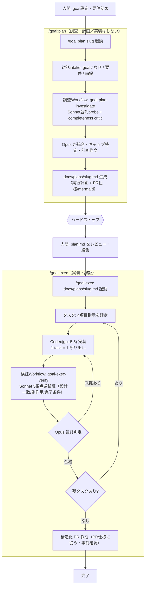

# Goal: ~/.claude の README.md に AI自動開発フロー（Mermaid＋自然言語）と /goal:plan・/goal:exec の prompt雛形を記載する

> slug: `claude-readme-devflow` ／ 実行は `/goal:exec ~/.claude/docs/plans/claude-readme-devflow.md`（作業ルート＝`~/.claude`）。
> 生成: `/goal:plan`（調査Workflow goal-plan-investigate, 3 agents）→ Opus が実ファイル・critic で照合し確定。
> 注: 調査 probe が本 plan の草案を Bash で生成していたため、Opus が内容を検証し critic の訂正を反映して上書き確定した。

## 背景（なぜ / 要件 / 前提）

- **なぜ:** `~/.claude`（GitHub `DKen-DevCat/.claude`）は全プロジェクト共通の開発フロー正本リポだが README が無く（GitHub 上で「Add a README」状態）、目的・v3 役割反転フロー・`/goal:plan`/`/goal:exec` の使い方が一目で分からない。入口（案内板）として README を新設する。
- **要件（ユーザ確定。4項目は必須）:**
  1. **AI自動開発フロー図を Mermaid で記載**。
  2. **AI自動開発フローを自然言語で記載**（図とは別に、文章での流れ説明）。
  3. **`/goal:plan` の prompt 雛形を記載**。
  4. **`/goal:exec` の prompt 雛形を記載**。
  - 加えて: リポジトリ概要・ディレクトリ構成・各プロジェクト接続・ブランチ運用も簡潔に。日本語。現行実ファイルと矛盾しないこと。
- **前提（実ファイル / critic で確認済み）:**
  - `~/.claude/README.md` は**不在**（新規作成のみ。既存ファイルは不変）。`CLAUDE.md` が開発フロー正本v3として既存。
  - 現行 `commands/goal/plan.md` は手順1-6＋出力に `## PR仕様`（mermaid作業フロー含む）。`commands/goal/exec.md` は各タスク (a)明確化/(b)`codex exec --model gpt-5.5 --sandbox workspace-write`/(c)検証Workflfow＋全task後 `## PR 作成`（事前確認）。
  - **`docs/plans/` は `.gitignore` 対象**（`plans/` ルールが適中）。→ 本 plan.md は git 管理外のローカル作業 doc。**README はリポジトリ直下なので追跡対象＝commit/PR される**。
  - `~/.claude` は origin あり、base=`main`／統合=`develop`。本セッションで **develop→main PR** 運用を確立済み（PR #2, #3）。現在ローカル `develop` は origin/develop より 1 commit ahead（既知のマージコミット）。
  - `~/.codex/config.toml`・`~/.codex/rules/default.rules` は **このリポジトリ外（マシンローカル・版管理外）** → README から相対リンク不可。

## 調査結果（goal実態 / 現状実態 / ギャップ）

### goal実態（READMEが記述すべき開発フローの実体）
- **アクター/モデル分担**: 人間=goal設定・要件詰め ／ Opus=オーケストレート・計画統合・最終判定 ／ Sonnet=調査・逆検証・critic（並列Workflow） ／ Codex(gpt-5.5/xhigh)=実装（Workflow外・top-level同期・1task=1呼び出し）。
- **`/goal:plan`**: 対話intake → 調査Workflow(`goal-plan-investigate`：goal/current 並列probe＋critic) → Opus統合 → `docs/plans/<slug>.md`（実行計画＋`## PR仕様`）生成 → **ハードストップ**（実装・編集・codex 禁止）。
- **`/goal:exec`**: 承認済み plan.md を唯一の真実に、各タスクで〔4項目指示 → codex 実装 → 検証Workflow(`goal-exec-verify`：design-match/side-effects/completion の3視点逆検証) → Opus最終判定／乖離は差戻し〕→ 全task後に **構造化 PR 作成**（`## PR仕様` に従う・破壊的/外向き操作は事前確認）。

### 現状実態（README周辺）
- `~/.claude/README.md` 不在。フロー正本は `CLAUDE.md` に記述済み。README は**重複せず補完**する（視覚化＋自然言語クイックスタート＋prompt雛形＋索引）。
- フロー全体を俯瞰する **Mermaid 図はどのファイルにも無い**（plan.md の PR仕様 mermaid は PR単位の作業図のみ）。README が初の全体図を提供する。
- ユーザが `/goal:plan`・`/goal:exec` 起動時に渡す **prompt雛形がどこにも明文化されていない**（plan.md 手順1の4項目／exec.md の plan パス引数が構造的根拠）。
- `phase-*`/`pj-*` skills は別軸フローとして共存（`CLAUDE.md` `## Skills config` が契約面）。

### ギャップ
- **G1**: 入口 README が無い → 新規作成。
- **G2**: フロー全体の Mermaid 図が無い → README 用に新規設計（下記下書き）。
- **G3**: 自然言語のフロー説明が無い → README に文章で記載。
- **G4**: `/goal:plan`・`/goal:exec` の prompt雛形が無い → README に明示（下記下書き）。
- **G5**: README と CLAUDE.md の役割分担（案内板 vs 正本）が未定義 → README で明確化しリンク。

## 実行計画

- [ ] task-1: `~/.claude/README.md` を新規作成する
  - 操作対象: `/Users/ooizumiyou/.claude/README.md`（新規）
  - 操作内容: 下記**コンテンツ仕様**どおりに日本語 README を作成（codex が作成、内容は本 plan で Opus が確定）。各番号がユーザ要件にどう対応するか併記:
    1. **概要**: 本リポジトリ＝全プロジェクト共通の開発フロー正本。README は案内板（視覚化＋クイックスタート＋索引）、正本は `CLAUDE.md` である旨。
    2. **AI自動開発フロー図（Mermaid）**〔要件1〕: 下記「Mermaid下書き」を掲載。
    3. **AI自動開発フローの自然言語説明**〔要件2〕: 図を文章で補足。「人間が goal/要件を渡す → `/goal:plan` が調査 Workflow で計画を生成し**停止** → 人間が plan.md をレビュー/編集 → `/goal:exec` が plan を唯一の真実として codex 実装＋検証 Workflow を回し、合格後に構造化 PR を作成」という流れと、役割反転（Claude=設計/検証、Codex=実装、人間=goal/要件）を明記。
    4. **`/goal:plan` の prompt 雛形**〔要件3〕: 下記「prompt雛形下書き」の plan 用ブロック。
    5. **`/goal:exec` の prompt 雛形**〔要件4〕: 下記「prompt雛形下書き」の exec 用ブロック。
    6. **役割分担とモデル方針**: 人間／Opus／Sonnet／Codex(gpt-5.5) の表（`CLAUDE.md` の要約＋正本リンク）。
    7. **ディレクトリ構成 / 索引**: `CLAUDE.md`・`commands/goal/{plan,exec}.md`・`workflows/{goal-plan-investigate,goal-exec-verify}.workflow.js`・`skills/`・`settings.json` への**相対リンク**と一行説明。**`~/.codex`（codex設定）はこのリポジトリ外＝相対リンクせず「マシンローカル・版管理外」と言及のみ**。
    8. **各プロジェクトの接続**: 各 PJ の `CLAUDE.md` が「開発フローは global `~/.claude/CLAUDE.md` と `/goal:plan`・`/goal:exec` を正本とする」必読ポインタ＋`## Skills config`（base_branch 等）を持つ旨。
    9. **ブランチ運用**: 本リポは `develop` で作業し **`develop → main` の PR** で反映する旨（1〜2行）。
    10. （任意）**他フロー**: `phase-*`/`pj-*` skills を「別軸」として1〜2行＋`CLAUDE.md` 参照（未確定#1）。
  - 影響場所と効果: リポジトリに入口 README が生まれ、フローが図＋文章で俯瞰でき、plan/exec の依頼方法が明文化される。`CLAUDE.md` 等の既存ファイルは不変。
  - goalへの影響: 要件1〜4＋補足を満たし goal を達成（G1〜G5 解消）。

### Mermaid下書き（READMEに載せる全体フロー図）


### prompt雛形下書き（READMEに載せる依頼テンプレ）
`/goal:plan`（計画フェーズの起動。調査して計画を生成し停止する）:
```
/goal:plan <goal-slug>

goal: <達成したいゴール>
なぜ: <なぜ必要か / 背景>
要件: <満たすべき条件・制約・成果物>
前提: <把握している前提情報・対象範囲・関連ファイル>
```
`/goal:exec`（実行フェーズの起動。承認済み plan.md のパスのみ＝plan.md が唯一の真実）:
```
/goal:exec docs/plans/<goal-slug>.md
```

## 未確定・要判断事項

1. **phase-*/pj-* skills の README での扱い**:
   - A（推奨）: `/goal` フローを主軸に、`phase-*`/`pj-*` は「別軸のフロー」として1〜2行＋`CLAUDE.md ## Skills config` 参照に留める。
   - B: `phase-*` も図・説明込みで併記（README が大きくなる）。
   - C: 一切触れない。
2. **Mermaid 図の枚数**:
   - A（推奨）: 全体フロー1枚（上記下書き）。
   - B: 全体＋plan/exec の小図に分割（詳細だが冗長）。
3. **prompt雛形の粒度**:
   - A（推奨）: ユーザ依頼テンプレ（上記の入力 skeleton）。READMEの読者＝依頼者向け。
   - B: コマンド prompt 本体（plan.md/exec.md の手順全文）も別途引用。

> 既に確定済み（本セッションの運用に整合。再判断不要）: **PR 運用＝`develop→main` PR**（PR作成は exec 時に事前確認）／**著者＝codex**（README は純 markdown）／**相互リンク＝README→CLAUDE.md のみ**（CLAUDE.md は不変）。

## PR仕様（PR / スコープごと。/goal:exec はこの仕様どおりに PR 本文を書く）
- PR-1: `DKen-DevCat/.claude` / README 新設（開発フロー文書化）
  - 目的: `~/.claude` リポジトリに入口 README を新設し、AI自動開発フローを Mermaid＋自然言語で示し、`/goal:plan`・`/goal:exec` の prompt雛形を提供する。
  - 満たすべき要件: (1)Mermaid フロー図 (2)自然言語フロー説明 (3)`/goal:plan` prompt雛形 (4)`/goal:exec` prompt雛形 (5)概要/構成/接続/ブランチ運用 (6)日本語・`CLAUDE.md`（正本）を重複せず補完しリンク。
  - 着手前の立ち位置 / 完了後の立ち位置: 着手前＝README なし・フローは `CLAUDE.md` のテキストのみ ／ 完了後＝`README.md` がフロー図＋自然言語説明＋prompt雛形＋索引を提供。
  - 作業フロー図（mermaid。本PRでの作業内容を図示）:
    ```mermaid
    flowchart TD
      A[着手前: READMEなし] --> B["task-1: README.md 作成<br/>概要/全体Mermaid/自然言語/prompt雛形/役割/索引/接続/ブランチ"]
      B --> C["検証: 実ファイル照合<br/>4要件充足・CLAUDE.md不変・相対リンク有効・~/.codexは外部言及のみ"]
      C --> D["develop→main PR 作成（事前確認）"]
      D --> E[完了: 入口README]
    ```
  - 解決タスクと goal への効果: task-1 を解決＝goal（フロー図＋自然言語＋prompt雛形の記載）を達成。
  - PR外への影響: **なし**。新規ファイル `README.md` のみ。`CLAUDE.md`・`commands`・`workflows`・`~/.codex` は不変。`docs/plans/` は `.gitignore` 対象のため本 plan.md は PR に含まれない（README のみ commit）。
  - その他共有事項: README は `CLAUDE.md`（正本）を補完する案内板で、フロー定義の重複を避ける。base=`main`／head=`develop` の PR（本セッションの確立運用）。`~/.codex` は外部・版管理外のため相対リンクせず言及のみ。

---

plan.md を確認・編集のうえ `/goal:exec ~/.claude/docs/plans/claude-readme-devflow.md` を実行してください。
